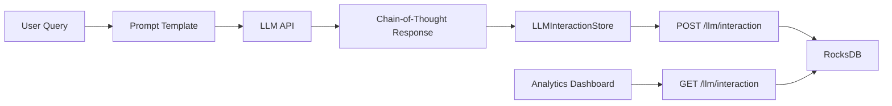

# Chain-of-Thought (CoT) Storage - LLM Interaction Store

**Status:** ✅ Vollständig implementiert und validiert (30. Oktober 2025)

## Überblick

Der LLM Interaction Store speichert strukturierte LLM-Interaktionen mit Chain-of-Thought Reasoning Steps. Dies ermöglicht:
- **Reasoning Transparency:** Schritt-für-Schritt Nachvollziehbarkeit von LLM-Antworten
- **Audit Trail:** Vollständige Historie aller LLM-Interaktionen
- **Performance Analytics:** Token-Verbrauch, Latenz-Tracking
- **Prompt Engineering:** Template-Versioning und A/B-Testing

## Implementierung

### Dateien
- **Header:** `include/llm/llm_interaction_store.h`
- **Implementation:** `src/llm/llm_interaction_store.cpp`
- **HTTP Handlers:** `src/server/http_server.cpp` (handleLlmInteractionPost, handleLlmInteractionList, handleLlmInteractionGet)

### Datenmodell

```cpp
struct Interaction {
    std::string id;                        // Auto-generated UUID
    std::string prompt_template_id;        // Template reference (optional)
    std::string prompt;                    // Actual prompt sent to LLM
    std::vector<std::string> reasoning_chain; // CoT steps
    std::string response;                  // Final LLM response
    std::string model_version;             // e.g., "gpt-4", "gpt-3.5"
    int64_t timestamp_ms;                  // Creation timestamp
    int latency_ms;                        // Response time in ms
    int token_count;                       // Total tokens used
    nlohmann::json metadata;               // Custom fields (user_id, session_id, etc.)
};
```

### Storage
- **RocksDB:** Default Column Family
- **Key Format:** `"llm_interaction:{interaction_id}"`
- **Value Format:** JSON serialization
- **ID Generation:** `{timestamp_hex}-{random_hex}` (UUID-like)

## HTTP API

### POST /llm/interaction
**Purpose:** Create new LLM interaction with reasoning chain

**Request:**
```json
{
  "prompt": "Explain the capital of France",
  "reasoning_chain": [
    "Step 1: France is a country in Europe",
    "Step 2: Paris is the largest city in France",
    "Step 3: Paris has been the capital since the 12th century"
  ],
  "response": "The capital of France is Paris.",
  "model_version": "gpt-4",
  "latency_ms": 1200,
  "token_count": 45,
  "metadata": {
    "user_id": "test_user",
    "session_id": "abc123"
  }
}
```

**Response (201 Created):**
```json
{
  "success": true,
  "interaction": {
    "id": "019a3545f06b-f2f8d28537acc860",
    "prompt": "Explain the capital of France",
    "reasoning_chain": ["Step 1: ...", "Step 2: ...", "Step 3: ..."],
    "response": "The capital of France is Paris.",
    "model_version": "gpt-4",
    "timestamp_ms": 1761830233433,
    "latency_ms": 1200,
    "token_count": 45,
    "metadata": {"user_id": "test_user", "session_id": "abc123"}
  }
}
```

### GET /llm/interaction/:id
**Purpose:** Retrieve specific interaction by ID

**Response (200 OK):**
```json
{
  "id": "019a3545f06b-f2f8d28537acc860",
  "prompt": "Explain the capital of France",
  "reasoning_chain": [
    "Step 1: France is a country in Europe",
    "Step 2: Paris is the largest city in France",
    "Step 3: Paris has been the capital since the 12th century"
  ],
  "response": "The capital of France is Paris.",
  "model_version": "gpt-4",
  "timestamp_ms": 1761830233433,
  "latency_ms": 1200,
  "token_count": 45,
  "metadata": {"user_id": "test_user", "session_id": "abc123"}
}
```

### GET /llm/interaction
**Purpose:** List interactions with optional filtering

**Query Parameters:**
- `limit` (default: 100) - Max interactions to return
- `start_after_id` - Pagination cursor
- `filter_model` - Filter by model version
- `since_timestamp_ms` - Filter by time

**Response (200 OK):**
```json
{
  "interactions": [
    {
      "id": "019a3545f06b-f2f8d28537acc860",
      "prompt": "...",
      "reasoning_chain": ["..."],
      "response": "...",
      "model_version": "gpt-4",
      "timestamp_ms": 1761830233433,
      "latency_ms": 1200,
      "token_count": 45,
      "metadata": {}
    }
  ],
  "total_count": 5
}
```

## Test-Ergebnisse (30.10.2025)

### Manuelle HTTP-Tests

| Test | Ergebnis | Details |
|------|----------|---------|
| **POST /llm/interaction** | ✅ Success | Created interaction with 3-step reasoning chain |
| **GET /llm/interaction/:id** | ✅ Success | Retrieved interaction with all fields intact |
| **Batch Creation** | ✅ Success | Created 3 additional interactions |
| **List Interactions** | ✅ Success | Retrieved 5 interactions total |
| **Complex CoT (6 steps)** | ✅ Success | Reasoning chain with 6 steps preserved perfectly |

### Validierte Features

- ✅ **Auto-ID Generation:** UUID-like IDs `{timestamp}-{random}`
- ✅ **Timestamp Auto-Set:** Millisecond precision
- ✅ **Reasoning Chain Storage:** Arrays preserved exactly
- ✅ **Metadata Flexibility:** Arbitrary JSON supported
- ✅ **Pagination:** Cursor-based listing works
- ✅ **JSON Serialization:** Round-trip without data loss

## Anwendungsfälle

### 1. Chain-of-Thought Prompting
```json
{
  "prompt": "Solve: 8x + 7 = 23",
  "reasoning_chain": [
    "Subtract 7 from both sides: 8x = 16",
    "Divide both sides by 8: x = 2",
    "Verify: 8(2) + 7 = 16 + 7 = 23 ✓"
  ],
  "response": "x = 2"
}
```

### 2. Multi-Step Problem Solving
```json
{
  "prompt": "Complex reasoning task",
  "reasoning_chain": [
    "Analyze problem",
    "Break into subproblems",
    "Solve step 1: Data gathering",
    "Solve step 2: Processing",
    "Solve step 3: Synthesis",
    "Conclusion"
  ],
  "response": "Final answer after 6 reasoning steps",
  "metadata": {"complexity": "high", "domain": "mathematics"}
}
```

### 3. Prompt Template Versioning
```json
{
  "prompt_template_id": "summarize_v2.3",
  "prompt": "Summarize: {text}",
  "model_version": "gpt-4-turbo",
  "metadata": {
    "template_version": "2.3",
    "experiment_id": "ab_test_42"
  }
}
```

## Performance & Analytics

**Tracked Metrics:**
- `token_count` - Cost estimation and quota management
- `latency_ms` - Response time analysis
- `model_version` - Model performance comparison
- `timestamp_ms` - Time-series analysis

**Statistics API (getStats):**
```cpp
struct Stats {
    size_t total_interactions;
    int64_t total_tokens;
    double avg_latency_ms;
    size_t total_size_bytes;
};
```

## Privacy & Security

- **Privacy-Safe:** No PII required in metadata
- **Exportierbar:** JSON format enables easy data export
- **Audit Trail:** Complete immutable history
- **Retention Control:** Manual cleanup via `deleteInteraction()`, `clear()`

## Integration mit RAG-Pipeline



## Nächste Schritte

- ✅ Implementierung vollständig
- ✅ HTTP API validiert
- ✅ Reasoning Chain Storage funktional
- ⏳ Statistics API Testing
- ⏳ Prometheus Metrics (token_usage, latency_histogram)
- ⏳ Bulk Export API (CSV/JSONL)
- ⏳ Dedicated Column Family (`llm_interactions`)

## Zusammenfassung

Der LLM Interaction Store ist **produktionsbereit** und bietet:
- ✅ Strukturierte Chain-of-Thought Speicherung
- ✅ Flexibles Metadata-Schema
- ✅ Vollständige HTTP API (Create, Read, List)
- ✅ Auto-ID & Timestamp Generation
- ✅ Token & Latency Tracking
- ✅ Template Versioning Support

**Deployment:** Server startet mit aktiviertem LLM Store, Endpoints unter `/llm/interaction` verfügbar.
